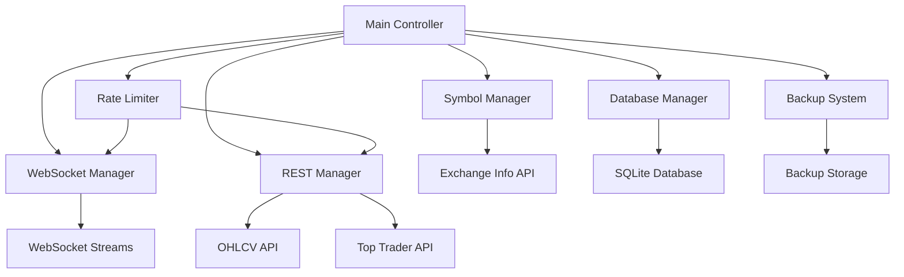

# Design Document

## Overview

The Binance Data Collector is a comprehensive cryptocurrency data collection system that retrieves OHLCV data and Top Trader information from Binance's public APIs. The system uses a hybrid approach combining WebSocket streams for real-time 1-minute data and REST API calls for historical and periodic data collection.

## Architecture

The system follows a modular architecture with clear separation of concerns:



## Components and Interfaces

### Symbol Manager
- **Purpose**: Manages trading symbol lifecycle and metadata
- **Key Methods**:
  - `updateSymbols()`: Daily symbol refresh from Exchange Information
  - `getActiveSymbols(market: string)`: Returns active symbols by market type
  - `markSymbolInactive(symbol: string)`: Handles delisted symbols
- **Data Storage**: Symbols table with status, market type, and metadata

### WebSocket Manager
- **Purpose**: Handles real-time 1-minute OHLCV data collection
- **Key Features**:
  - Connection pooling (max 300 symbols per stream)
  - Automatic reconnection with exponential backoff
  - Stream health monitoring
- **Data Flow**: Raw WebSocket data → Validation → Database insertion

### REST Manager
- **Purpose**: Collects 30min/daily OHLCV and Top Trader data
- **Key Methods**:
  - `collectOHLCV(timeframe: string)`: Retrieves historical OHLCV data
  - `collectTopTraderData()`: Fetches position and account data every 5 minutes
- **Scheduling**: Cron-based scheduling for different data types#
## Rate Limiter
- **Purpose**: Prevents API violations and manages request queuing
- **Implementation**: Token bucket algorithm with per-endpoint tracking
- **Key Features**:
  - Request weight calculation based on Binance API documentation
  - Automatic backoff when approaching limits
  - Priority queuing for critical requests
- **Retry Logic**: Exponential backoff with jitter (1s, 2s, 4s, 8s, 16s, 32s, 60s max)

### Database Manager
- **Purpose**: Handles SQLite operations with data integrity protection
- **Key Features**:
  - Connection pooling for concurrent operations
  - Transaction-based writes to prevent corruption
  - Automatic schema migrations
- **Tables**:
  - `symbols`: Symbol metadata and status
  - `ohlcv_1m`, `ohlcv_30m`, `ohlcv_1d`: OHLCV data by timeframe
  - `top_trader_positions`, `top_trader_accounts`: Top trader data

### Backup System
- **Purpose**: Ensures data persistence and recovery capabilities
- **Schedule**: Daily backups at 00:00 UTC
- **Storage**: ~/Volume/buffakohd/backups/ with timestamp naming
- **Retention**: 30 days of daily backups, 12 weeks of weekly backups

## Data Models

### Symbol Model
```typescript
interface Symbol {
  symbol: string;
  baseAsset: string;
  quoteAsset: string;
  market: 'SPOT' | 'USDT-M' | 'COIN-M';
  status: 'ACTIVE' | 'INACTIVE';
  lastUpdated: Date;
}
```

### OHLCV Model
```typescript
interface OHLCVData {
  symbol: string;
  openTime: Date;
  closeTime: Date;
  open: number;
  high: number;
  low: number;
  close: number;
  volume: number;
  quoteVolume: number;
  trades: number;
}
```

### Top Trader Model
```typescript
interface TopTraderData {
  symbol: string;
  timestamp: Date;
  longShortRatio: number;
  longAccount: number;
  shortAccount: number;
  longPosition: number;
  shortPosition: number;
}
```## 
Error Handling

### WebSocket Error Handling
- **Connection Failures**: Automatic reconnection with exponential backoff
- **Data Validation**: Schema validation for incoming messages
- **Stream Interruption**: Graceful degradation and recovery
- **Logging**: Comprehensive error logging with context

### REST API Error Handling
- **Rate Limiting**: Automatic retry with backoff when limits exceeded
- **Network Errors**: Retry logic with circuit breaker pattern
- **Data Validation**: Response validation before database insertion
- **Partial Failures**: Continue processing other symbols when individual requests fail

### Database Error Handling
- **Connection Issues**: Connection pooling with automatic retry
- **Write Conflicts**: Transaction-based writes with deadlock detection
- **Corruption Detection**: Regular integrity checks and backup recovery
- **Disk Space**: Monitoring and alerting for storage capacity

## Testing Strategy

### Unit Testing
- **Component Testing**: Individual component functionality
- **Mock Services**: Binance API mocking for reliable testing
- **Database Testing**: In-memory SQLite for fast test execution
- **Rate Limiter Testing**: Time-based testing with mock timers

### Integration Testing
- **End-to-End Flows**: Complete data collection workflows
- **API Integration**: Real Binance API testing in staging environment
- **Database Integration**: Full SQLite operations testing
- **Error Scenarios**: Failure mode testing and recovery validation

### Performance Testing
- **Load Testing**: High-volume data collection simulation
- **Memory Usage**: Long-running process memory leak detection
- **Database Performance**: Query optimization and indexing validation
- **WebSocket Scalability**: Multiple stream connection testing

## Deployment Configuration

### Environment Variables
- `BINANCE_API_KEY`: API key for authenticated endpoints (if needed)
- `DATABASE_PATH`: Path to SQLite database file (~/Volume/buffakohd)
- `BACKUP_PATH`: Backup storage location
- `LOG_LEVEL`: Logging verbosity control
- `RATE_LIMIT_BUFFER`: Safety margin for rate limiting (default: 10%)

### File Structure
```
~/Volume/buffakohd/
├── binance_data.sqlite          # Main database
├── backups/                     # Backup directory
│   ├── binance_data_20241027.sqlite
│   └── ...
└── logs/                        # Application logs
    ├── collector.log
    └── error.log
```

### Monitoring and Alerting
- **Health Checks**: Regular system health monitoring
- **Data Quality**: Missing data detection and alerting
- **Performance Metrics**: Collection rates and processing times
- **Error Tracking**: Comprehensive error logging and notification